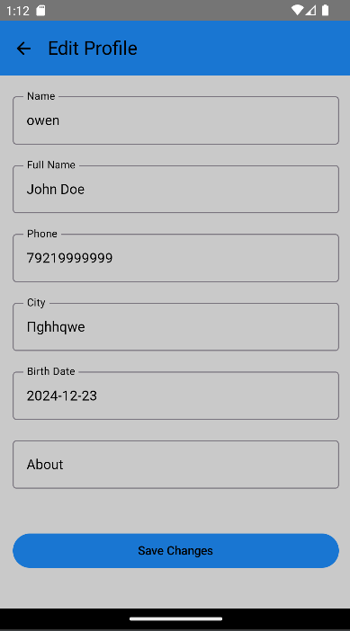
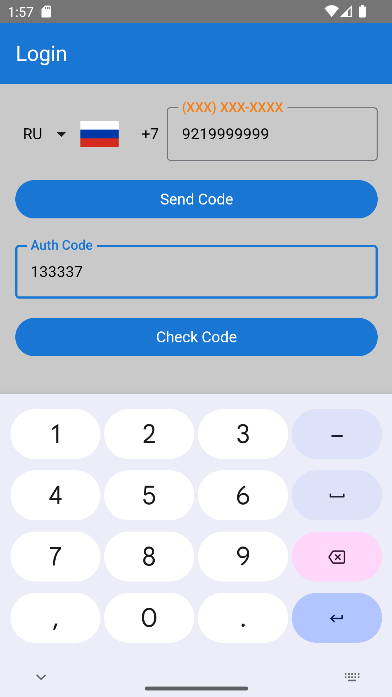
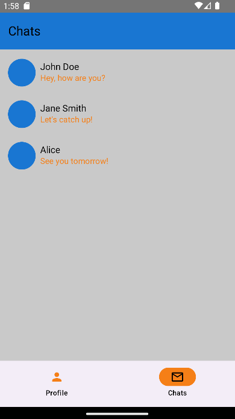
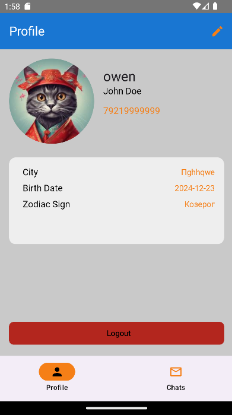
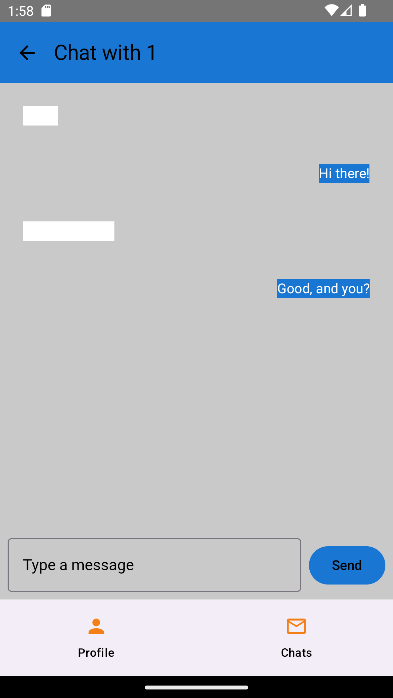

# **ChatVerse**

ChatVerse – это Android-приложение, созданное для удобной авторизации, персонализированного профиля и общения в чатах. Проект построен на основе Jetpack Compose и Clean Architecture для обеспечения высококачественного пользовательского опыта и легкости масштабирования.  

---

## **Функциональные возможности**
- 📱 Авторизация через номер телефона и код подтверждения.  
- 📝 Регистрация с настройкой уникального профиля.  
- 👤 Просмотр и редактирование персональных данных.  
- 💬 Удобный интерфейс для общения в чатах.  

---

## **Технологии**
- **Язык:** Kotlin  
- **UI:** Jetpack Compose  
- **Архитектура:** Clean Architecture  
- **База данных:** Room  
- **Сетевые запросы:** Retrofit  
- **Авторизация:** JWT  

---

## **Скриншоты**  







---

## **Как запустить проект**
1. Убедитесь, что у вас установлен **Android Studio Arctic Fox или выше**.  
2. Клонируйте репозиторий:  
   ```bash
   git clone https://github.com/mike-shukra/chat-verse.git
3. Импортируйте проект в Android Studio.
4. Проверьте, что ваш API-ключ доступен в файле local.properties или другом конфигурационном файле.
5. Синхронизируйте зависимости Gradle.
6. Запустите проект на эмуляторе или реальном устройстве.

## **Лицензия**
Этот проект распространяется под кастомной лицензией.
Использование разрешено только в личных и образовательных целях. Коммерческое использование запрещено.
## License  
This project is licensed under a custom license. See the [LICENSE](LICENSE) file for details.

## **Контакты**
Если у вас есть вопросы или предложения, свяжитесь с нами:
📧 white.electric.dog@gmail.com


## **Дополнительно**
Ссылки на API документацию: PlannerOK API
Полезные ресурсы:
Jetpack Compose Docs
Kotlin Language Reference
🎉 Спасибо за использование ChatVerse!
